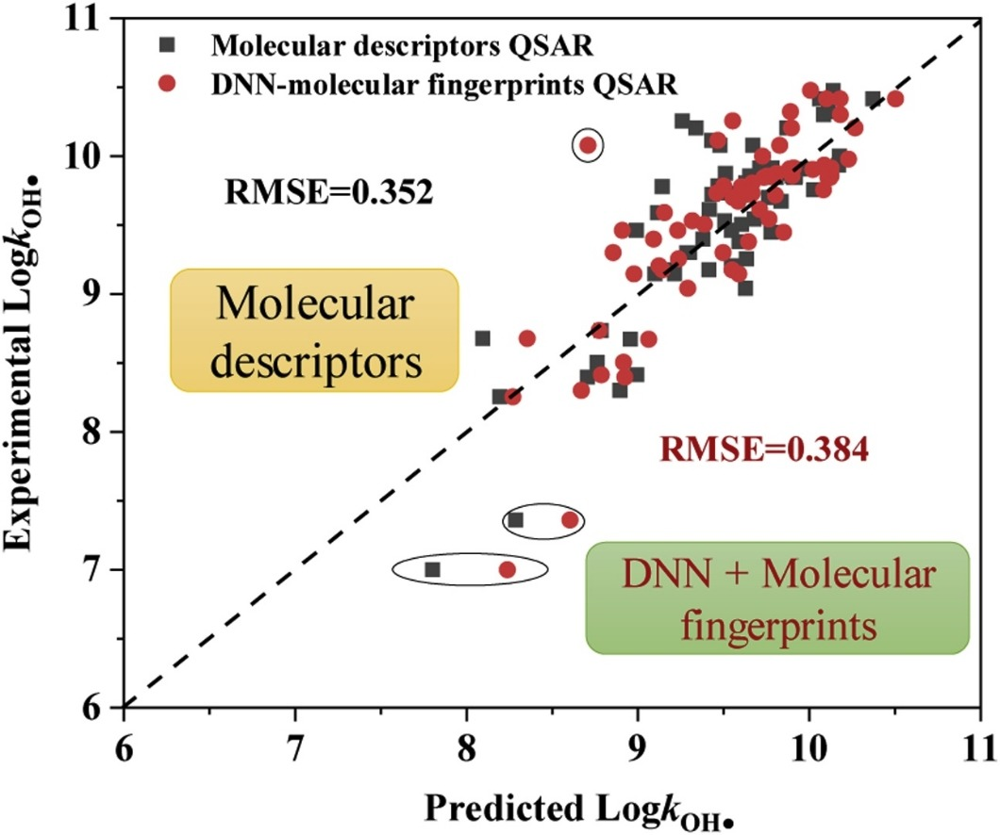

# DNN-MF

This work combined Deep Neural Network (DNN) with molecular fingerprints (MF) to develop models to predict the OH• radical rate constants of 593 organic contaminants.

 
Our study has been published on Journal of Hazardous Materials. Please cite our paper if you use this code or data in your own work: [A deep neural network combined with molecular fingerprints (DNN-MF) to develop predictive models for hydroxyl radical rate constants of water contaminants](https://www.sciencedirect.com/science/article/pii/S0304389419310957#fig0015)

Hope our work is benefitial for you. Thanks!
